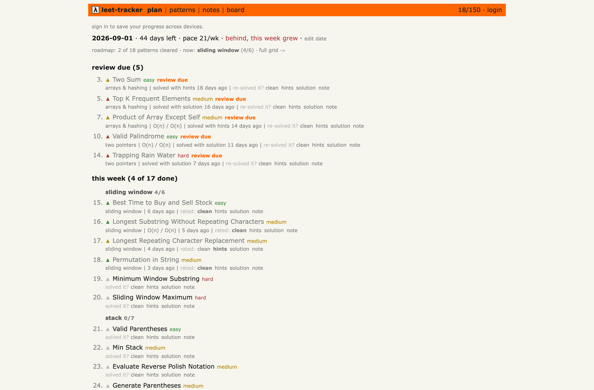

# leet-tracker

A NeetCode-150 tracker that paces you to your interview date.

Tell it when your interview is. It does the math: the list becomes a weekly plan that recomputes as you go, and shaky solves come back for review before you forget them. Looks like Hacker News on purpose.

**→ https://leet150.vercel.app**



## How it works

- Pick a date. Pace = problems left ÷ time left, recomputed every visit. Any date is legal.
- Rate each solve: clean, hints, or solution. One tap.
- Solution reads come back for review in about a week, hint solves in two. Clean never does.
- Mastery grid: pattern × confidence at a glance.
- Notes and time/space complexity per problem, grouped into a per-pattern cheatsheet.
- Weekly leaderboard, resets Monday. All ratings count the same.
- Tight timeline? One tap trims the plan to the Blind 75.

Works without an account, saved in the browser. Sign in with Google to sync across devices and join the board.

## Run it locally

```bash
git clone https://github.com/joudbitar/leet-tracker.git
cd leet-tracker
npm install && npm run dev
```

That's it. Without `.env.local` the app runs in local-only mode. Cross-device sync and the leaderboard need a Firebase project (free Spark tier):

1. [Firebase console](https://console.firebase.google.com): create a project, add a **web app**, copy its config into `.env.local` (see `.env.example`).
2. Authentication → Sign-in method: enable Google, add your domain under Authorized domains.
3. Firestore: create a database, then paste `firebase/firestore.rules` in the Rules tab (or `firebase deploy --only firestore:rules`).

## How it's built

React 19 + TypeScript + Vite, deployed on Vercel. The whole app is about 1,400 lines of source. The backend is Firebase (Google sign-in + Firestore), and I picked it because I ran out of free Supabase projects. Nothing is married to it: all the sync lives in four small hooks, so Postgres or anything else swaps in.

- The planner is one pure function ([src/lib/plan.ts](src/lib/plan.ts)): your solve history and a target date go in, the full week-chunked path comes out. Nothing is stored; it recomputes on every visit.
- The weekly quota is computed from Monday, so a mid-week solve never reshuffles the plan under you. Re-planning happens Monday, from whatever is actually left.
- Local-first: everything works signed out, saved in localStorage. On sign-in, local-only work is pushed up and the server wins everywhere else.
- Each user's progress is a single Firestore doc: one read per login, one merge-write per action. Stays inside the free tier.
- No component library. The UI is hand-styled after Hacker News.

## What it doesn't do

- It doesn't touch your LeetCode account. Solves are self-reported, one tap; there is no scraping or sync.
- The leaderboard trusts your taps. No verification.

## License

MIT. PRs welcome: [CONTRIBUTING.md](CONTRIBUTING.md).
